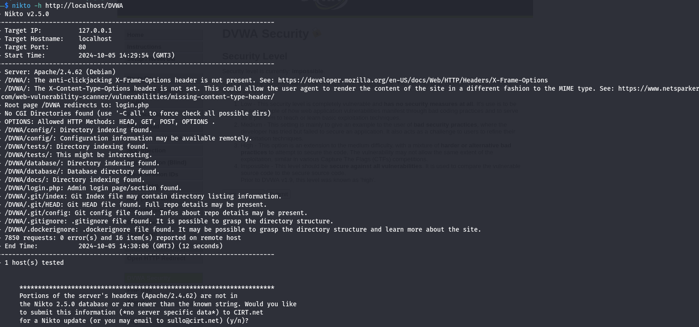
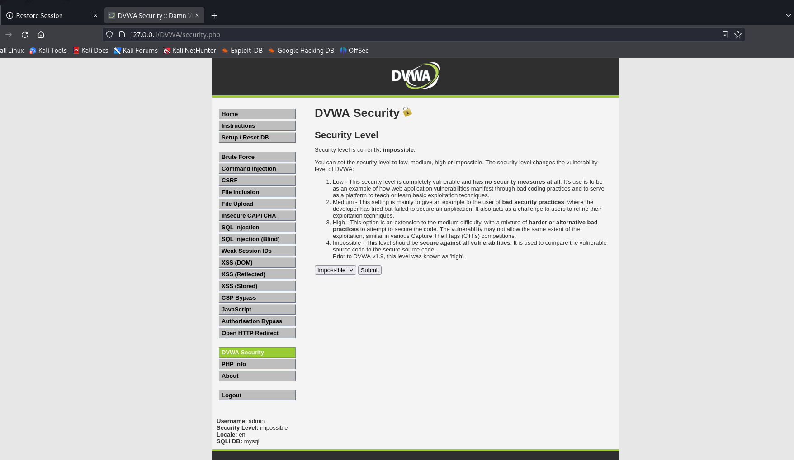
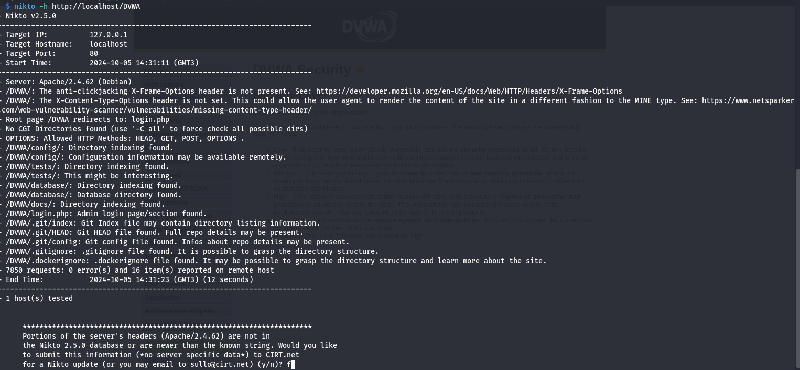

---
## Front matter
lang: ru-RU
title: Презентация по четвертому этапу проекта
author:
  - Ханина Людмила Константиновна

## i18n babel
babel-lang: russian
babel-otherlangs: english

## Formatting pdf
toc: false
toc-title: Содержание
slide_level: 2
aspectratio: 169
section-titles: true
theme: metropolis
header-includes:
 - \metroset{progressbar=frametitle,sectionpage=progressbar,numbering=fraction}
---

#  Отчет по пятому этапу проекта

## Цели и задачи

Burp Suite представляет собой набор мощных инструментов безопасности веб-приложений, которые демонстрируют реальные возможности злоумышленника, проникающего в веб-приложения

## Запустим сервисы Apache2 и MySQL:

## В разделе DVWA SEcurity выставим значение Low:

## Запустим сканер Nikto:

## Попробуем изменить значение на Impossible:

## Запустим сканер еще раз:

## Выводы
В ходе выполнения третьего этапа проекта я приобрела практический навык по использованию инструмента Nikto.
