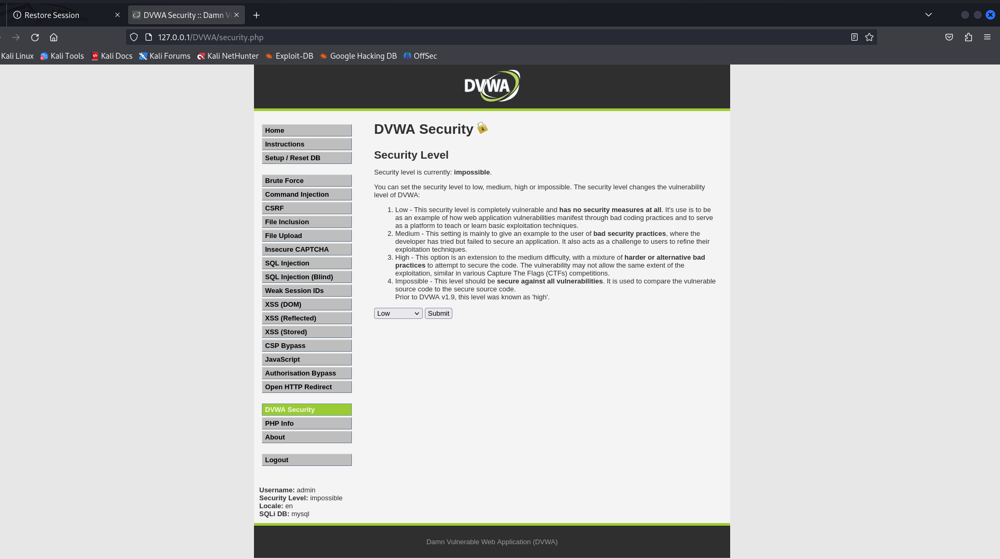
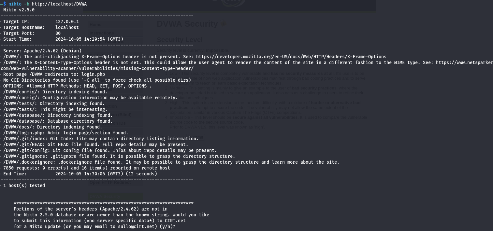
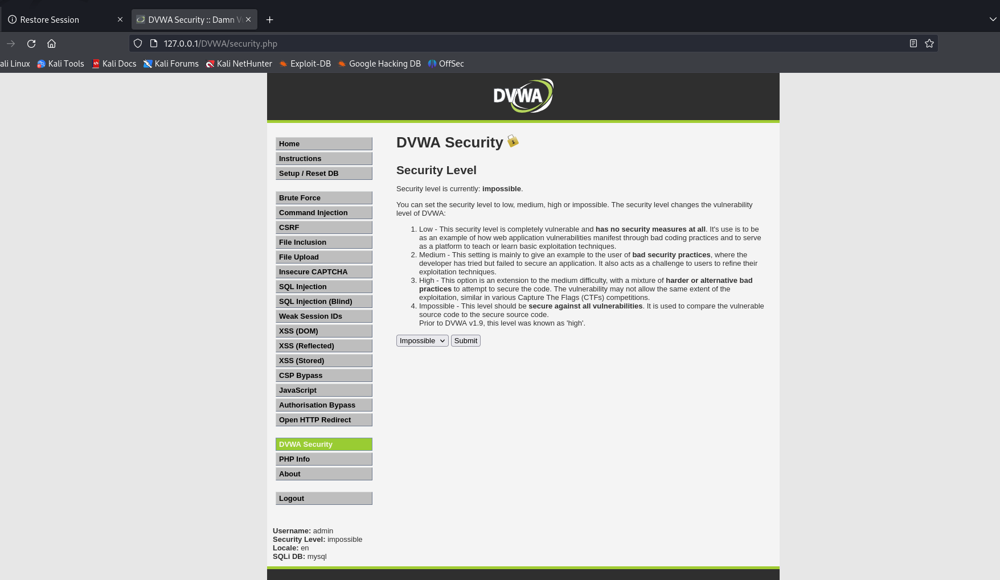
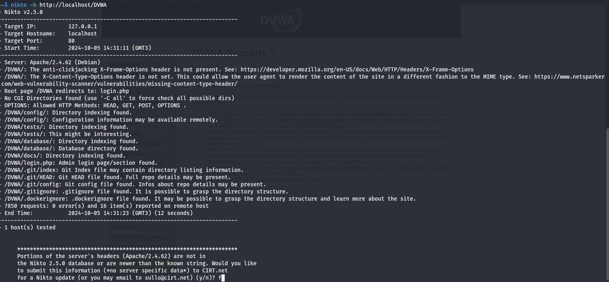

# **Отчет по пятому этапу проекта**
## **Common information**
discipline: Основы информационной безопасности  
group: НПМбд-02-21  
author: Ханина Людмила Константиновна
---
---
## **Цель работы**

Burp Suite представляет собой набор мощных инструментов безопасности веб-приложений, которые демонстрируют реальные возможности злоумышленника, проникающего в веб-приложения

## **Выполнение работы**

1. Запустим сервисы Apache2 и MySQL:

2. В разделе DVWA SEcurity выставим значение Low:

3. Запустим сканер Nikto:

4. Попробуем изменить значение на Impossible:

5. Запустим сканер еще раз:

Проведем анализ вывода:

* **Server: Apache/2.4.62 (Debian)**
* **/DVWA/: The anti-clickjacking X-Frame-Options header is not present.**

    Отсутствие заголовка X-Frame-Options означает, что сайт может быть подвержен атаке clickjacking.

    Кликджекинг (clickjacking) — обманная технология, основанная на размещении вызывающих какие-то действия невидимых элементов на сайте поверх видимых активных (кнопки, воспроизведение видео и т. д.).

* **/DVWA/: The X-Content-Type-Options header is not set. This could allow the user agent to render the content of the site in a different fashion to the MIME type.**

    Если заголовок X-Content-Type-Options не установлен, это может привести к тому, что старые версии Internet Explorer и Chrome будут выполнять MIME-анализ тела ответа. Это может привести к тому, что тело ответа будет интерпретировано и отображено как тип контента, отличный от объявленного.

* **Root page /DVWA redirects to: login.php**

    Иллюстрация имени авторизационного скрипта.

* **OPTIONS: Allowed HTTP Methods: GET, POST, OPTIONS, HEAD.**

    Эндпоинт имеет несколько методов.
  * **/DVWA/config/: Directory indexing found.**

    Найдена индексация каталогов.

* **/DVWA/config/: Configuration information may be available remotely.**

    Найден эндпоинт, по которому может содержаться информация о конфигурации

* **/DVWA/tests/: Directory indexing found.**

    Найдена индексация каталогов.

* **/DVWA/tests/: This might be interesting.**

    Найдена папка с тестами.

* **/DVWA/database/: Directory indexing found.**

    Найдена индексация каталогов.

* **/DVWA/database/: Database directory found.**

    Найдена директория, содержащая информацию о БД

* **/DVWA/docs/: Directory indexing found.**

    Найдена индексация каталогов.
  * **/DVWA/login.php: Admin login page/section found.**

    Найден эндпоинт для входа в админ-панель

* **/DVWA/.git/index: Git Index file may contain directory listing information.**

* **/DVWA/.git/HEAD: Git HEAD file found. Full repo details may be present.**

* **/DVWA/.git/config: Git config file found. Infos about repo details may be present.**

* **/DVWA/.gitignore: .gitignore file found. It is possible to grasp the directory structure.**

    Найдена информацию о системе контроля версий.

* **/DVWA/.dockerignore: .dockerignore file found. It may be possible to grasp the directory structure and learn more about the site.**

    Файл .dockerignore содержит список файлов и папок, которые быть исключены при сборки образов Docker для развертывания в контейнерах.

## **Вывод**

В ходе выполнения третьего этапа проекта я приобрела практический навык по использованию инструмента Nikto.
